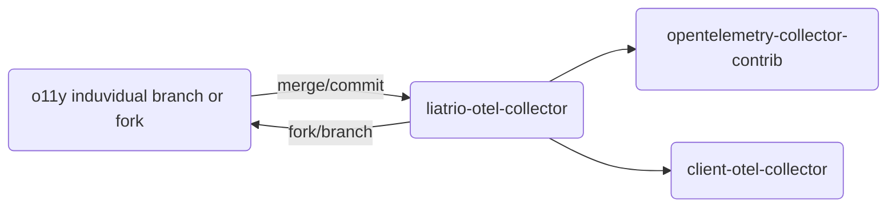

# Contributing to open o11y

Anyone is welcome to contribute to open o11y, and there's a few major
aspects of this project to which one can contribute.
This guide will help you understand how our project works and how you can contribute effectively.
If you have any questions that aren't answered in this guide, please feel free to reach out on our [Slack Team](https://liatrio.slack.com/archives/C04KGSFF407).

## Table of Contents

- [Contributing to open o11y](#contributing-to-open-o11y)
  - [Table of Contents](#table-of-contents)
  - [Getting Started](#getting-started)
  - [Github Repositories](#github-repositories)
  - [Liatrio Distribution of the Open Telemetry Collector](#liatrio-distribution-of-the-open-telemetry-collector)
  - [Github Issues](#github-issues)
  - [Open Source Projects](#open-source-projects)
  - [Automation \& Deployment](#automation--deployment)
  - [Communication](#communication)

## Getting Started

Before you start contributing, make sure to set up your development environment.
Details can be found in our [README.md](https://github.com/liatrio/openo11y.dev/blob/main/README.md) file.

## Github Repositories

The following is a list of repositories that relate or are actively being developed as part
of **open o11y**.

- [o11y-platform-deployment](https://github.com/liatrio/o11y-platform-deployment) #[branch] Terragrunt deployment repo for the o11y platform
- [aws-managed-service-module](https://github.com/liatrio/aws-managed-services) #[branch] TF module for managed services in AWS for o11y
- [o11y-docs](https://github.com/liatrio-delivery-povs/o11y-docs) #[branch] GitHub pages repo hosting this docs website
- [liatrio-otel-collector](https://github.com/liatrio/liatrio-otel-collector) #[branch] Liatrio's distribution of the OTEL Collector
- [opentelemetry-collector-contrib](https://github.com/open-telemetry/opentelemetry-collector-contrib) #[fork] the repo we fork and contribute to on the OTEL project
- [oteps](https://github.com/open-telemetry/oteps) #[fork] the repo we fork for enhancement proposals contributing back to the community via OTEL
- [sdc](https://github.com/liatrio/sdc) #[branch] the original SDC repo, this is deprecated in favor for adding components to the OTEL distro

Our projects follow a mixture of the Github Fork Flow model and short lived branches.
You will notice above a [tag] that will let you know which each project is.
For repos with a [fork] tag, his means that you will need to create a fork of our repository,
make your changes there, and then create a pull request to contribute those changes back to the main repository.

Here are some general steps to follow:

1. Fork the repository by clicking the "Fork" button in the top right corner of the repository page.
2. Clone the forked repository to your local machine.
3. Create a new branch for your changes using `git checkout -b your-branch-name`.
4. Make your changes and commit them with a clear and concise commit message.
5. Push your changes to your forked repository.
6. Go to the original repository and create a new pull request. Be sure to select your fork and the branch that you worked on.

**NOTE**: We encourage inner sourcing within our team.
This means that team members are free to contribute to any part of the project,
not just the parts they are assigned to.

## Liatrio Distribution of the Open Telemetry Collector

Liatrio maintains a distribution of the Open Telemetry Collector geared towards
productionalized workloads, removing many of the exporters and receivers that exist
in the binary by default. It also has allowed us to quickly contribute working
receivers, processors, authenticators, and exporters prior to contributing back to the
OSS project.

Our end state goal for this distribution is to ensure its features are contributed back
to the official OSS project 100% of the time where our code changes are accepted. Our predominant
reason for maintaining our own distribution is for fast custom development and reduction of undeeded go
packages, ensuring use of OTLP where ever possible.

Our model of contribution is reflected in the below diagram:

## Github Issues

We use Github Issues hosted in a Github project that is attached to multiple repos.
To keep everything organized, each issue should correspond to a specific feature or bug. Here's how you can contribute:

1. Look for open issues in the [Github project](https://github.com/orgs/liatrio/projects/25/views/1).
2. Comment on the issue you wish to work on and reach out in [#project-o11y slack](https://liatrio.slack.com/archives/C04KGSFF407).
Make sure no one else is working on it.
3. If you find a bug or have a feature idea that doesn't have an issue, feel free to create one.

## Open Source Projects

We rely heavily on open source projects.
If you find a bug or feature that you think should be implemented in one of these projects, consider contributing there first.
This includes submitting PRs to forked projects that are hosted internally.

## Automation & Deployment

Our project has automation set up to deploy to various locations.
You can find scripts and instructions in the [deployment](#) directory.
If you have any suggestions for improving our automation and deployment process, we would love to hear them.

## Communication

We use Slack for most of our team communication.
If you have any questions or need clarifications, feel free to ask in our [#general](#) channel.
Remember to be respectful and considerate in your communication.

We look forward to your contributions!
