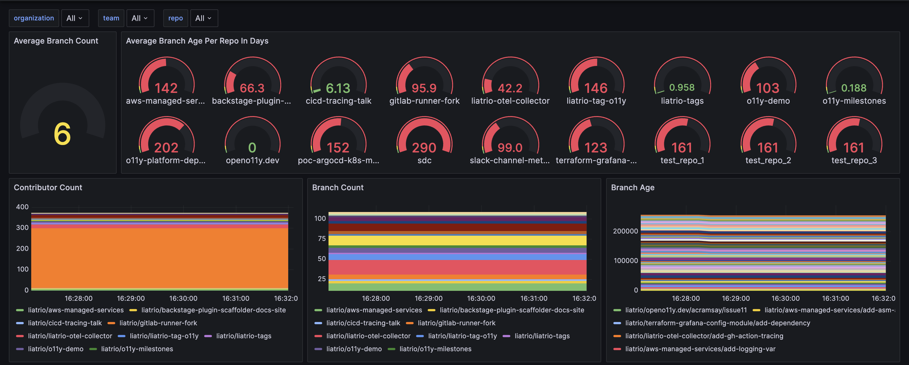
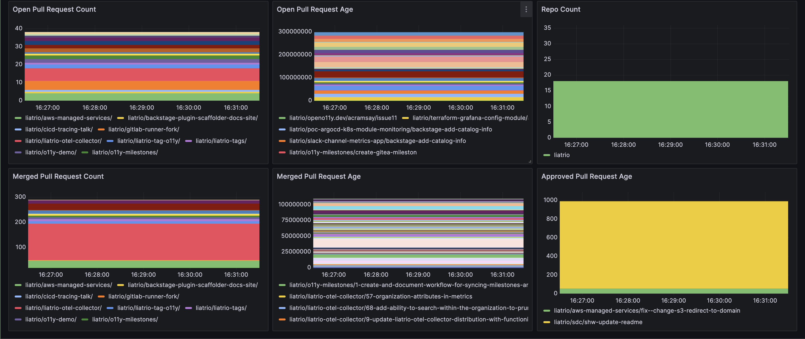

# Delivery Metrics Demo via GitHub and OpenTelemetry

## Introduction

Welcome to the Delivery Metrics demo page! This demo is a fork of the
[OpenTelemetry Demo][oteldemo] leveraging the [Liatrio OTEL Collector][lotelcol]
distribution in an additional profile to provide the following additional
capabilities:

* Leading delivery indicators from GitHub using the Git Provider Receiver
* DORA Metrics from GitHub through the WebHook Event Receiver

At this point in time, the demo fork is only extended to work locally via
Docker.

## Getting Started

### Prerequisites

* The same set of prerequisites defined for the [OpenTelemetry Demo][oteldemoreqs]
* Clone the [Liatrio OpenTelemetry Demo][loteldemo] using git
* Any prerequisites defined in the [Delivery Demo Documentation][loteldemoreqs]

### General Commands

Once those docs are reviewed and prerequisites met run either (or both):

* `make start-delivery`
* `make start-dora`

If setup via the guide in the demo, then you should start to see metrics like
the below screenshots by navigating to Grafana:

* Grafana: <http://localhost:8080/grafana/>

[lotelcol]: https://github.com/liatrio/liatrio-otel-collector
[loteldemo]: https://github.com/liatrio/opentelemetry-demo
[loteldemoreqs]: https://github.com/liatrio/opentelemetry-demo/blob/main/docs/delivery.md#pre-requisites
[oteldemo]: https://opentelemetry.io/docs/demo/
[oteldemoreqs]: https://opentelemetry.io/docs/demo/docker-deployment/#prerequisites
